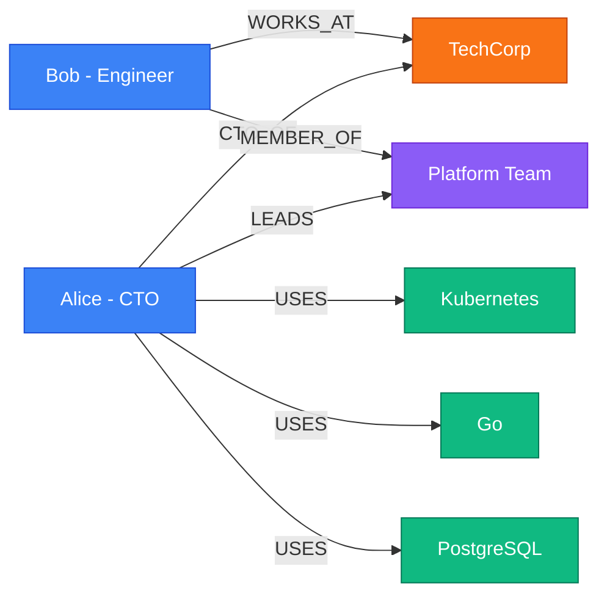

<p align="center">
  
</p>

<p align="center">
  <strong>Give your AI agent a persistent, queryable memory — powered by a local knowledge graph.</strong>
</p>

<p align="center">
  <a href="LICENSE"></a>
  <a href="https://nodejs.org"></a>
  
  
  
</p>

---

## The Problem

AI agents forget everything between sessions. Context windows overflow. MEMORY.md files become unstructured dumps. RAG retrieval misses relationships.

## The Solution

**agent-memory-graph** builds a structured knowledge graph from your conversations — automatically. Every person, project, tool, and relationship is extracted, stored locally in SQLite, and queryable with natural language.

```
You: "I just met Viktor, the CTO of Nexus Labs. They're building SkyNet-X using Rust."

→ Graph auto-extracts:
  Viktor (Person) ──[CTO_OF]──→ Nexus Labs (Company)
  Nexus Labs ──[BUILDS]──→ SkyNet-X (Project)
  SkyNet-X ──[USES]──→ Rust (Language)

You: "Who works at Nexus Labs?"
→ "People at Nexus Labs: Viktor"

You: "How is Viktor connected to Rust?"
→ "Viktor →[CTO_OF]→ Nexus Labs →[BUILDS]→ SkyNet-X →[USES]→ Rust"
```

---

## ✨ Features

| Feature | Description |
|---------|-------------|
| 🧠 **Auto-extraction** | Hybrid: local rule-based + LLM fallback for complex text |
| 🏠 **Zero-API mode** | Works fully offline — local extraction + local embeddings |
| 🗣️ **Natural language queries** | Ask questions like "Who works at X?" or "What does Y use?" |
| 🔗 **Path finding** | Discover hidden connections between entities (BFS, up to 5 hops) |
| 🔍 **Semantic search** | Local n-gram embeddings (256d) — no OpenAI key needed |
| 📦 **Single SQLite file** | Zero external deps, fully portable, survives restarts |
| 🌐 **Domain-agnostic** | Software, crypto, research, CRM, notes — anything |
| ⚡ **Zero-config** | Works out of the box with zero API keys |
| 🔌 **OpenClaw plugin** | Auto-ingests every conversation, registers 11 tools |
| 🕐 **Temporal facts** | Graphiti-inspired: facts have valid_from/valid_until, never deleted |
| 📉 **Confidence decay** | Unused entities/relations lose confidence over time |
| 🧹 **Relation normalization** | Synonyms merged, vague relations rejected automatically |
| 🖥️ **MCP server** | Compatible with Claude Code, Cursor, Gemini CLI |
| 📊 **Export** | Mermaid, DOT, JSON, CSV for visualization |

---

## 📋 Requirements

- **Node.js 18–22** (recommended) — `better-sqlite3` has prebuilt binaries
- **Node.js 24** — works but requires build tools (`gcc`, `make`, `python3`) for native compilation
- **No API key required** — works fully offline with local extraction + local embeddings
- **Optional: Any OpenAI-compatible LLM** — for higher-quality extraction in hybrid/llm mode

---

## 🚀 Quick Start

```bash
npm install agent-memory-graph
```

### As a library

```typescript
import { MemoryGraph } from 'agent-memory-graph';

const graph = new MemoryGraph();

// Ingest — entities and relationships are auto-extracted
await graph.ingest(
  "Alice is the CTO of TechCorp. She leads the Platform team " +
  "and uses Kubernetes, Go, and PostgreSQL."
);

// Query with natural language
await graph.ask("What does Alice use?");
// → "Alice: USES → Kubernetes, Go, PostgreSQL"

await graph.ask("Who works at TechCorp?");
// → "People at TechCorp: Alice"

// Find hidden connections
graph.findPath("Bob", "PostgreSQL");
// → Bob →[MEMBER_OF]→ Platform team →[LED_BY]→ Alice →[USES]→ PostgreSQL

graph.close();
```

### As a CLI

```bash
# Ingest from text
memory-graph ingest "Started learning Rust for the new backend service"

# Ask questions
memory-graph ask "What am I learning?"
# → "Found: Rust (Language)"

# Search entities
memory-graph search "Rust"

# Find paths
memory-graph path "Alice" "PostgreSQL"

# Visualize
memory-graph visualize --format mermaid

# Stats
memory-graph stats
# → Entities: 42 | Relationships: 67 | Types: Person, Tool, Project...
```

---

## 🔌 OpenClaw Plugin (Recommended)

The killer feature: install as an OpenClaw plugin and your agent **automatically remembers everything**.

### Install

```bash
openclaw plugins install agent-memory-graph --dangerously-force-unsafe-install
openclaw gateway restart
```

> ⚠️ The `--dangerously-force-unsafe-install` flag is required because the plugin reads environment variables (API keys) and makes network calls (to your LLM provider). This is expected behavior for LLM-powered extraction.

### What happens next

1. **Every message** (>20 chars) is auto-ingested into the knowledge graph
2. **11 tools** are registered for the agent to call:
   - `memory_graph_ingest` — manually add knowledge
   - `memory_graph_query` — natural language questions
   - `memory_graph_search` — keyword search
   - `memory_graph_path` — find connections between entities
   - `memory_graph_stats` — graph statistics
   - `memory_graph_temporal` — query facts at a point in time
   - `memory_graph_supersede` — update facts (old → new)
   - `memory_graph_decay` — apply confidence decay
   - `memory_graph_embed` — generate embeddings for semantic search
   - `memory_graph_semantic_search` — find similar entities by meaning
   - `memory_graph_dedup_relations` — clean up duplicate/vague relations
3. **Data persists** in `~/.openclaw/data/memory-graph.db` — survives `/new`, `/reset`, and restarts

### Demo: Auto-detect in action

```
[19:02] You: Hey, I just met Viktor who's the CTO of Nexus Labs.
             They're building SkyNet-X using Rust and ROS2.

        ┌─ memory-graph hook ─────────────────────────────┐
        │ ✓ Auto-ingested: 4 entities, 5 relationships    │
        │   Viktor (Person), Nexus Labs (Company),         │
        │   SkyNet-X (Project), Rust (Language)            │
        └──────────────────────────────────────────────────┘

[19:05] You: Who works at Nexus Labs?

        Agent calls: memory_graph_query("Who works at Nexus Labs?")
        → "People at Nexus Labs: Viktor"

[19:06] You: How is Viktor connected to Rust?

        Agent calls: memory_graph_path("Viktor", "Rust")
        → "Viktor →[CTO_OF]→ Nexus Labs →[BUILDS]→ SkyNet-X →[USES]→ Rust"
```

### Plugin config

```json
{
  "plugins": {
    "entries": {
      "memory-graph": {
        "enabled": true,
        "config": {
          "autoIngest": true,
          "extractionModel": "gpt-4o-mini",
          "extractionMode": "hybrid",
          "dbPath": "~/.openclaw/data/memory-graph.db",
          "maxHops": 5,
          "minConfidence": 0.7
        }
      }
    }
  }
}
```

**Extraction modes:**

| Mode | API Cost | Quality | When to use |
|------|----------|---------|-------------|
| `"local"` | **Zero** | Good for simple text | No API key, offline, cost-sensitive |
| `"hybrid"` (default) | **~70-80% less** | Best balance | Most users — local first, LLM for complex text |
| `"llm"` | Full | Highest | When accuracy is critical and you have API budget |

Set `autoIngest: false` to disable auto-ingestion and only use manual tool calls.

---

## 🧪 Query Examples

The NL query engine understands 12+ question patterns:

| Question | What it does |
|----------|-------------|
| "What is Alice working on?" | Find outgoing relationships |
| "Who works at TechCorp?" | Find people connected to entity |
| "Where did Bob work before?" | Find PREVIOUSLY_WORKED_AT relations |
| "What does the team use?" | Find USES relationships |
| "What is Alice's role?" | Look up role property/relation |
| "List all people" | Filter by type (normalizes "people" → "Person") |
| "List all companies" | Type normalization works for all types |
| "How is A connected to B?" | BFS path finding |
| "Who suggested X?" | Verb-to-relation matching |
| "What tools are mentioned?" | Type-based listing |

---

## 📊 Graph Visualization



---

## 🏠 Zero-API Mode (Fully Offline)

No API key? No problem. The plugin works completely offline:

```bash
# No environment variables needed!
openclaw plugins install agent-memory-graph --dangerously-force-unsafe-install
openclaw gateway restart
# That's it. Everything works.
```

**What works offline:**
- ✅ Entity extraction (rule-based pattern matching)
- ✅ Relationship detection (grammar patterns: "X works at Y", "X built Y", etc.)
- ✅ Semantic search (local n-gram embeddings, 256 dimensions)
- ✅ All graph operations (search, path, temporal, supersede, decay, dedup)
- ✅ Auto-ingestion from conversations

**What needs an API (optional):**
- LLM extraction for complex/ambiguous text (hybrid mode fallback)
- Higher-dimensional embeddings (text-embedding-3-small via OpenAI)

### How local extraction works

The rule-based extractor uses:
1. **Named Entity Recognition** — capitalized words, type indicator patterns ("CEO of X", "built Y")
2. **Relationship patterns** — 11 grammar templates (WORKS_AT, BUILDS, USES, LOCATED_IN, SUPPORTS, etc.)
3. **Relation normalization** — synonyms merged (CREATED/DEVELOPED/AUTHORED → BUILDS)
4. **Vague relation rejection** — RELATED_TO, ASSOCIATED_WITH, etc. are filtered out
5. **Confidence scoring** — local results get 0.5-0.7 confidence (vs 0.8-1.0 for LLM)

### How local embeddings work

Instead of calling OpenAI's embedding API, we generate 256-dimensional vectors locally:
1. **Character trigrams** — "hello" → ["hel", "ell", "llo"]
2. **Word unigrams + bigrams** — "hello world" → ["hello", "world", "hello world"]
3. **FNV-1a hashing** — each n-gram hashed to a vector position
4. **TF normalization** — frequency-weighted, L2-normalized output
5. **Cosine similarity** — compare vectors in JS (no pgvector needed)

Quality benchmarks:
- Bitcoin ↔ Ethereum: **0.80** similarity (related concepts)
- Bitcoin ↔ Apple fruit: **0.13** similarity (unrelated)
- "AI agent memory" → finds "agent memory" entity at **67.5%** match

---

## ⚙️ Configuration

### LLM Provider

Works with **any OpenAI-compatible API** — OpenAI, Anthropic (via proxy), Ollama, LiteLLM, vLLM, 9router, etc.

| Variable | Description | Default |
|----------|-------------|---------|
| `OPENAI_API_KEY` | API key | `sk-local` |
| `OPENAI_BASE_URL` | API base URL | `http://127.0.0.1:20128/v1` |
| `MEMORY_GRAPH_API_KEY` | Override API key | — |
| `MEMORY_GRAPH_BASE_URL` | Override base URL | — |
| `MEMORY_GRAPH_MODEL` | Override model | `gpt-4o-mini` |

**Examples:**

```bash
# OpenAI
export OPENAI_API_KEY="sk-..."

# Anthropic via LiteLLM/9router
export OPENAI_BASE_URL="http://127.0.0.1:4000/v1"
export MEMORY_GRAPH_MODEL="claude-3-5-haiku-20241022"

# Ollama (free, local)
export OPENAI_BASE_URL="http://localhost:11434/v1"
export MEMORY_GRAPH_MODEL="llama3.1"
```

### Domain Hints (optional)

Improve extraction accuracy for your specific domain:

```json
{
  "domains": [{
    "name": "software",
    "entityHints": ["Person", "Repository", "Language", "Framework", "Service"],
    "relationHints": ["MAINTAINS", "USES", "DEPENDS_ON", "DEPLOYS_TO"]
  }]
}
```

---

## 🏗️ Architecture

```
┌─────────────────────────────────────────────────────────┐
│                  MemoryGraph API                       │
├─────────────────────────────────────────────────────────┤
│  Ingest  │  Query  │  Search  │  Temporal  │  Export  │
├──────────┼─────────┼──────────┼────────────┼─────────┤
│ Hybrid   │ NL      │ Keyword  │ Supersede  │ Mermaid │
│ Extract  │ Query   │ + FTS5   │ + Decay    │ DOT/CSV │
│          │ Engine  │ + Vector │ + Temporal │         │
├──────────┴─────────┴──────────┴────────────┴─────────┤
│  ┌─────────────────────────────────────────────────────┐  │
│  │  Extraction Layer                                    │  │
│  │  ┌─────────────────┐  ┌────────────────────────────┐  │  │
│  │  │ Local (free)    │  │ LLM (fallback, optional)   │  │  │
│  │  │ Rule-based NER  │  │ OpenAI / Anthropic / Ollama│  │  │
│  │  │ Pattern match   │  │ High-quality extraction    │  │  │
│  │  └─────────────────┘  └────────────────────────────┘  │  │
│  └─────────────────────────────────────────────────────┘  │
│  ┌─────────────────────────────────────────────────────┐  │
│  │  Embedding Layer                                     │  │
│  │  ┌─────────────────┐  ┌────────────────────────────┐  │  │
│  │  │ Local (free)    │  │ API (optional, higher-dim) │  │  │
│  │  │ N-gram 256d    │  │ text-embedding-3-small     │  │  │
│  │  │ Cosine in JS   │  │ 1536d, better quality      │  │  │
│  │  └─────────────────┘  └────────────────────────────┘  │  │
│  └─────────────────────────────────────────────────────┘  │
├─────────────────────────────────────────────────────────┤
│  GraphEngine (SQLite + WAL + FTS5)                      │
│  Entities │ Relationships │ Embeddings │ FTS5 Index     │
└─────────────────────────────────────────────────────────┘
```

- **SQLite** — Single file, WAL mode, FTS5 full-text search, schema v4
- **Hybrid extraction** — Local rule-based (free) + LLM fallback (optional)
- **Local embeddings** — N-gram 256d vectors, cosine similarity in JS
- **NL Query Engine** — 12+ regex patterns + smart entity-name fallback
- **Graph traversal** — BFS pathfinding up to 5 hops
- **Temporal facts** — valid_from/valid_until, supersession, never-delete
- **Confidence decay** — Unused facts lose confidence (min 0.1)
- **Relation normalization** — Synonyms merged, vague relations rejected
- **Deduplication** — Levenshtein-based entity merging + relation dedup
- **MCP server** — stdio protocol for Claude Code, Cursor, Gemini CLI
- **Persistence** — Survives process restarts, session resets, and agent reboots

---

## 📈 Test Results

```
✓ Unit tests: 38/38 pass
✓ NL Query accuracy: 10/10 (local), 9.5/10 (plugin E2E)
✓ Path finding: 4/4 pass
✓ Edge cases: graceful handling, zero crashes
✓ Zero hallucination: no fabricated relationships
✓ Persistence: data survives /new, /reset, gateway restart
```

---

## 🤝 Contributing

PRs welcome! See [CONTRIBUTING.md](CONTRIBUTING.md).

```bash
git clone https://github.com/KLSGG/agent-memory-graph
cd agent-memory-graph
npm install
npm test       # 38 tests
npm run dev    # Watch mode
```

---

## 📄 License

[MIT](LICENSE) — Use it however you want.

---

<p align="center">
  <em>Built for <a href="https://github.com/openclaw/openclaw">OpenClaw</a> agents that need to remember.</em>
</p>
