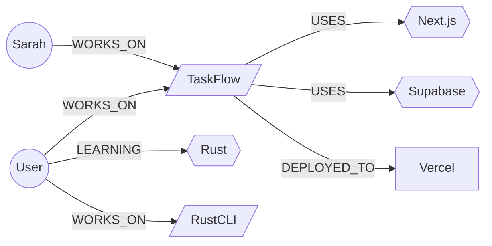

# Basic Usage

## Getting Started

After installing, you can start using agent-memory-graph immediately with zero configuration.

### 1. Ingest your first text

```bash
memory-graph ingest "I'm working on a web app called TaskFlow with my colleague Sarah. We use Next.js and Supabase."
```

Output:
```
✓ Extracted 4 entities, 3 relationships

Entities:
  • TaskFlow (Project) [90%]
  • Sarah (Person) [85%]
  • Next.js (Technology) [90%]
  • Supabase (Technology) [90%]

Relationships:
  • User -[WORKS_ON]-> TaskFlow [85%]
  • TaskFlow -[USES]-> Next.js [90%]
  • TaskFlow -[USES]-> Supabase [90%]
```

### 2. Ask questions

```bash
memory-graph ask "What technologies does TaskFlow use?"
# → TaskFlow uses Next.js and Supabase

memory-graph ask "Who works on TaskFlow?"
# → User and Sarah work on TaskFlow
```

### 3. Add more context over time

```bash
memory-graph ingest "We deployed TaskFlow to Vercel last week. Sarah handles the design."
memory-graph ingest "I'm also learning Rust for a side project called RustCLI."
```

### 4. Explore connections

```bash
memory-graph path "Sarah" "Vercel"
# → Sarah -[WORKS_ON]-> TaskFlow -[DEPLOYED_TO]-> Vercel

memory-graph neighborhood "TaskFlow" 2
# Shows all entities within 2 hops of TaskFlow
```

### 5. Visualize

```bash
memory-graph visualize --format mermaid
```

Output:


### 6. Import existing notes

```bash
memory-graph sync --source ~/notes/MEMORY.md
# ✓ Imported 23 entities, 41 relationships
```

## Tips

- **Ingest regularly** — The more context you feed, the richer the graph becomes
- **Be specific** — "Alice maintains the auth service" extracts better than "Alice does stuff"
- **Use `ask` for complex queries** — It handles multi-hop reasoning automatically
- **Export periodically** — `memory-graph export json > backup.json` for safety
